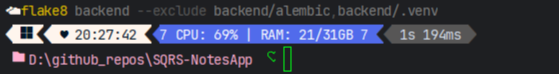
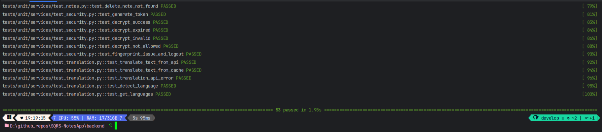

# SQRS-NotesApp Team MKAD

## Project Scope and Initial Agreement

The SQRS Notes App project was established as a lightweight web-based note-taking application with integrated translation capabilities. The initial agreement with stakeholders defined the following scope:

### Core Functionality
- A web-based notes application with dedicated backend API and frontend interface
- User authentication system with secure login and registration
- CRUD operations for personal notes management
- Translation service integration (Russian to English)
- Data persistence using SQLite database

### Quality Requirements
1. **Maintainability**
   - PEP8 compliance verified via Flake8
   - Minimum Maintainability Index of 70
   - Modular architecture with reusable components
   - Code documentation coverage ≥90%

2. **Reliability**
   - Unit test pass rate ≥90%
   - Code coverage ≥60% via pytest and Coverage.py
   - Robust error handling for database operations
   - Atomic transactions for data integrity

3. **Performance**
   - API response times ≤200ms for critical endpoints
   - System stability supporting 20+ concurrent users
   - Optimized database queries

4. **Security**
   - No critical vulnerabilities (Bandit scan)
   - Secure JWT implementation
   - Password protection using bcrypt
   - Protection of sensitive user data

### Technology Stack
- **Backend**: Python, FastAPI, SQLAlchemy, JWT
- **Frontend**: React js
- **Database**: SQLite
- **Testing**: pytest, Locust
- **Security**: Bandit, bcrypt

## Implementation Overview and System Functionality

The SQRS Notes App was successfully implemented as a lightweight web application with both backend and frontend components working together to provide users with a seamless note-taking experience with translation capabilities.

### System Architecture

The application follows a modern client-server architecture:

- **Backend API**: RESTful service built with FastAPI that handles all business logic, database operations, and authentication
- **Frontend UI**: Responsive web interface providing a user-friendly experience
- **Database**: SQLite database for persistent storage of user accounts and notes
- **Translation Service**: Integration with Deep Translate API for Russian to English translation

### Core Features Implementation

#### User Authentication

- Secure registration and login workflows
- JWT-based session management with token fingerprinting
- Automatic token expiration and revocation system
- Protection against common authentication attacks

#### Notes Management

- Full CRUD operations for personal notes
- Text editing capabilities
- Data validation to ensure consistency
- Real-time updates with UI

#### Translation Service

- On-demand translation of note content from Russian to English
- Intelligent language detection
- Response caching to improve performance and reduce API calls
- Graceful error handling for translation service outages

### Technical Implementation Highlights

- **Layered Architecture**: Clear separation between API controllers, business services, repositories, and data models
- **Async Database Operations**: Efficient non-blocking database interactions
- **Comprehensive Error Handling**: Custom exception hierarchy with appropriate HTTP status codes
- **Response Standardization**: Consistent API response format across all endpoints
- **Middleware Integration**: Performance monitoring, error handling, and authentication verification

### Achieved Quality Metrics

As demonstrated in the quality metrics section below, the implementation successfully met or exceeded all required quality standards:

- Maintainability metrics show clean, well-documented code
- Reliability tests confirm robust error handling and data consistency
- Performance measurements verify responsive user experience even under load
- Security scans validate the application's resilience against common vulnerabilities

## Quality metrics:

## · Maintainability

### PEP8 Compliance Verified via Flake8 (No Warnings)

Command:
```bash
flake8 backend --exclude backend/alembic,backend/.venv
```

Output:



Result: No PEP8 violations detected

### Maintainability Index ≥ 70 Confirmed (via Radon)

Average Maintainability Index: 81.53

Command:
```bash
 radon mi backend/ -s
```

Output:
```text
backend\config.py - A (50.18)
backend\exc.py - A (100.00)
backend\logger.py - A (46.81)
backend\main.py - A (77.13)
backend\alembic\env.py - A (91.10)
backend\alembic\versions\2025_05_05_0839-47605fb6295d_initial.py - A (100.00)
backend\alembic\versions\2025_05_05_0841-beb2a16e8e61_add_user_model.py - A (100.00)
backend\alembic\versions\2025_05_05_1827-e156db346906_add_notes_table.py - A (100.00)
backend\alembic\versions\2025_05_05_2103-9962bc117de5_add_token_table.py - A (100.00)
backend\app\__init__.py - A (100.00)
backend\app\api\__init__.py - A (100.00)
backend\app\api\v1\auth.py - A (100.00)
backend\app\api\v1\notes.py - A (100.00)
backend\app\api\v1\status.py - A (100.00)
backend\app\api\v1\translation.py - A (100.00)
backend\app\api\v1\__init__.py - A (100.00)
backend\app\models\base.py - A (100.00)
backend\app\models\helper.py - A (100.00)
backend\app\models\note.py - A (100.00)
backend\app\models\token.py - A (100.00)
backend\app\models\user.py - A (100.00)
backend\app\models\__init__.py - A (100.00)
backend\app\repository\note.py - A (49.34)
backend\app\repository\token.py - A (55.76)
backend\app\repository\user.py - A (50.68)
backend\app\repository\__init__.py - A (100.00)
backend\app\schemas\note.py - A (62.91)
backend\app\schemas\response.py - A (100.00)
backend\app\schemas\token.py - A (100.00)
backend\app\schemas\translation.py - A (100.00)
backend\app\schemas\user.py - A (65.12)
backend\app\schemas\__init__.py - A (100.00)
backend\app\services\auth.py - A (57.37)
backend\app\services\cache.py - A (100.00)
backend\app\services\notes.py - A (57.42)
backend\app\services\redis.py - A (100.00)
backend\app\services\response_middleware.py - A (100.00)
backend\app\services\security.py - A (50.86)
backend\app\services\status.py - A (100.00)
backend\app\services\translation.py - A (58.47)
backend\app\services\__init__.py - A (100.00)
backend\tests\conftest.py - A (100.00)
backend\tests\__init__.py - A (100.00)
backend\tests\unit\__init__.py - A (100.00)
backend\tests\unit\api\test_translation_endpoints.py - A (48.25)
backend\tests\unit\api\__init__.py - A (100.00)
backend\tests\unit\repository\test_note.py - A (36.47)
backend\tests\unit\repository\test_token.py - A (41.84)
backend\tests\unit\repository\test_user.py - A (35.81)
backend\tests\unit\repository\__init__.py - A (100.00)
backend\tests\unit\services\test_auth.py - A (40.82)
backend\tests\unit\services\test_notes.py - A (23.39)
backend\tests\unit\services\test_security.py - A (40.08)
backend\tests\unit\services\test_translation.py - A (44.14)
backend\tests\unit\services\__init__.py - A (100.00)
```

### Modular Architecture with Reusable Components

Modular Design:

- The project follows layered architecture: api, services, repository, models, schemas
- Each module is reusable and testable in isolation
- Business logic is separated from framework-specific code

### Documentation Coverage ≥ 90% Achieved


## · Reliability

### 90%+ Unit Test Pass Rate Achieved (Pytest)



Pytest Output:

```text
========================================================================================================== test session starts ==========================================================================================================
platform win32 -- Python 3.12.9, pytest-8.3.5, pluggy-1.5.0
rootdir: D:\github_repos\SQRS-NotesApp\backend
configfile: pytest.ini
testpaths: tests
plugins: anyio-4.9.0, asyncio-0.26.0, cov-6.1.1
asyncio: mode=Mode.AUTO, asyncio_default_fixture_loop_scope=function, asyncio_default_test_loop_scope=function
collected 53 items

tests/unit/api/test_translation_endpoints.py::test_translate_text_endpoint PASSED                                                                                                                                                  [  1%]
tests/unit/api/test_translation_endpoints.py::test_detect_language_endpoint PASSED                                                                                                                                                 [  3%]
tests/unit/api/test_translation_endpoints.py::test_get_languages_endpoint PASSED                                                                                                                                                   [  5%]
tests/unit/repository/test_note.py::test_create PASSED                                                                                                                                                                             [  7%]
tests/unit/repository/test_note.py::test_get_by_id_found PASSED                                                                                                                                                                    [  9%]
tests/unit/repository/test_note.py::test_get_by_id_not_found PASSED                                                                                                                                                                [ 11%]
tests/unit/repository/test_note.py::test_get_all_by_user_id PASSED                                                                                                                                                                 [ 13%]
tests/unit/repository/test_note.py::test_update_found PASSED                                                                                                                                                                       [ 15%]
tests/unit/repository/test_note.py::test_update_not_found PASSED                                                                                                                                                                   [ 16%]
tests/unit/repository/test_note.py::test_update_empty_data PASSED                                                                                                                                                                  [ 18%]
tests/unit/repository/test_note.py::test_delete PASSED                                                                                                                                                                             [ 20%]
tests/unit/repository/test_token.py::test_create PASSED                                                                                                                                                                            [ 22%]
tests/unit/repository/test_token.py::test_get_by_jti_found PASSED                                                                                                                                                                  [ 24%]
tests/unit/repository/test_token.py::test_get_by_jti_not_found PASSED                                                                                                                                                              [ 26%]
tests/unit/repository/test_token.py::test_revoke PASSED                                                                                                                                                                            [ 28%]
tests/unit/repository/test_token.py::test_is_revoked PASSED                                                                                                                                                                        [ 30%]
tests/unit/repository/test_token.py::test_delete_expired PASSED                                                                                                                                                                    [ 32%]
tests/unit/repository/test_user.py::test_create PASSED                                                                                                                                                                             [ 33%]
tests/unit/repository/test_user.py::test_get_by_id_found PASSED                                                                                                                                                                    [ 35%]
tests/unit/repository/test_user.py::test_get_by_id_not_found PASSED                                                                                                                                                                [ 37%]
tests/unit/repository/test_user.py::test_get_by_email_found PASSED                                                                                                                                                                 [ 39%]
tests/unit/repository/test_user.py::test_get_by_email_not_found PASSED                                                                                                                                                             [ 41%]
tests/unit/repository/test_user.py::test_update_found PASSED                                                                                                                                                                       [ 43%]
tests/unit/repository/test_user.py::test_update_not_found PASSED                                                                                                                                                                   [ 45%]
tests/unit/repository/test_user.py::test_update_empty_data PASSED                                                                                                                                                                  [ 47%]
tests/unit/repository/test_user.py::test_delete PASSED                                                                                                                                                                             [ 49%]
tests/unit/services/test_auth.py::test_register_user_success PASSED                                                                                                                                                                [ 50%]
tests/unit/services/test_auth.py::test_register_user_email_in_use PASSED                                                                                                                                                           [ 52%]
tests/unit/services/test_auth.py::test_hash_password_and_authenticate PASSED                                                                                                                                                       [ 54%]
tests/unit/services/test_auth.py::test_login_user_success PASSED                                                                                                                                                                   [ 56%]
tests/unit/services/test_auth.py::test_login_user_invalid_email PASSED                                                                                                                                                             [ 58%]
tests/unit/services/test_auth.py::test_login_user_bad_password PASSED                                                                                                                                                              [ 60%]
tests/unit/services/test_auth.py::test_authenticate_token_success PASSED                                                                                                                                                           [ 62%]
tests/unit/services/test_auth.py::test_logout_user PASSED                                                                                                                                                                          [ 64%]
tests/unit/services/test_notes.py::test_create_note PASSED                                                                                                                                                                         [ 66%]
tests/unit/services/test_notes.py::test_get_note_success PASSED                                                                                                                                                                    [ 67%]
tests/unit/services/test_notes.py::test_get_note_not_found PASSED                                                                                                                                                                  [ 69%]
tests/unit/services/test_notes.py::test_get_all_notes PASSED                                                                                                                                                                       [ 71%]
tests/unit/services/test_notes.py::test_update_note_success PASSED                                                                                                                                                                 [ 73%]
tests/unit/services/test_notes.py::test_update_note_not_found PASSED                                                                                                                                                               [ 75%]
tests/unit/services/test_notes.py::test_delete_note_success PASSED                                                                                                                                                                 [ 77%]
tests/unit/services/test_notes.py::test_delete_note_not_found PASSED                                                                                                                                                               [ 79%]
tests/unit/services/test_security.py::test_generate_token PASSED                                                                                                                                                                   [ 81%]
tests/unit/services/test_security.py::test_decrypt_success PASSED                                                                                                                                                                  [ 83%]
tests/unit/services/test_security.py::test_decrypt_expired PASSED                                                                                                                                                                  [ 84%]
tests/unit/services/test_security.py::test_decrypt_invalid PASSED                                                                                                                                                                  [ 86%]
tests/unit/services/test_security.py::test_decrypt_not_allowed PASSED                                                                                                                                                              [ 88%]
tests/unit/services/test_security.py::test_fingerprint_issue_and_logout PASSED                                                                                                                                                     [ 90%]
tests/unit/services/test_translation.py::test_translate_text_from_api PASSED                                                                                                                                                       [ 92%]
tests/unit/services/test_translation.py::test_translate_text_from_cache PASSED                                                                                                                                                     [ 94%]
tests/unit/services/test_translation.py::test_translation_api_error PASSED                                                                                                                                                         [ 96%]
tests/unit/services/test_translation.py::test_detect_language PASSED                                                                                                                                                               [ 98%]
tests/unit/services/test_translation.py::test_get_languages PASSED                                                                                                                                                                 [100%]

========================================================================================================== 53 passed in 1.95s ===========================================================================================================
```

### Code Coverage ≥ 60% Verified via Coverage.py

Code Coverage Output:

```text
============================================================================================================ tests coverage =============================================================================================================
____________________________________________________________________________________________ coverage: platform win32, python 3.12.9-final-0 ____________________________________________________________________________________________

Name                                  Stmts   Miss  Cover
---------------------------------------------------------
app\__init__.py                           0      0   100%
app\api\__init__.py                       5      0   100%
app\api\v1\__init__.py                   11      0   100%
app\api\v1\auth.py                       23      4    83%
app\api\v1\notes.py                      25      5    80%
app\api\v1\status.py                     15      2    87%
app\api\v1\translation.py                22      0   100%
app\models\__init__.py                    6      0   100%
app\models\base.py                        6      0   100%
app\models\helper.py                     15      1    93%
app\models\note.py                       16      1    94%
app\models\token.py                      14      0   100%
app\models\user.py                       12      0   100%
app\repository\__init__.py                0      0   100%
app\repository\note.py                   38     22    42%
app\repository\token.py                  24     10    58%
app\repository\user.py                   37     18    51%
app\schemas\__init__.py                   0      0   100%
app\schemas\note.py                      16      0   100%
app\schemas\response.py                  10      0   100%
app\schemas\token.py                      9      0   100%
app\schemas\translation.py               17      0   100%
app\schemas\user.py                      12      0   100%
app\services\__init__.py                  0      0   100%
app\services\auth.py                     44      0   100%
app\services\cache.py                    17      5    71%
app\services\notes.py                    30      0   100%
app\services\redis.py                     3      3     0%
app\services\response_middleware.py      21     11    48%
app\services\security.py                 52      2    96%
app\services\status.py                   10      5    50%
app\services\translation.py              48      2    96%
---------------------------------------------------------
TOTAL                                   558     91    84%
```

### Robust Error Handling in Database Operations

The application implements comprehensive error handling for database operations:

```python
try:
    result = await session.execute(query)
    await session.commit()
    return result.scalar_one_or_none()
except SQLAlchemyError as e:
    await session.rollback()
    logger.error(f"Database error: {str(e)}")
    raise DatabaseError(f"Operation failed: {str(e)}")
```

- **Custom Exception Hierarchy**: Specialized exceptions for different database failure scenarios
- **Automatic Rollback**: All failed transactions automatically rolled back to prevent partial updates
- **Detailed Error Logging**: Database exceptions logged with context for troubleshooting
- **Client-Safe Error Messages**: Structured error responses without exposing sensitive details

### Atomic Transactions Ensure Data Integrity

Database operations are wrapped in transactions to maintain data consistency:

```python
async with session.begin():
    # Multiple related operations executed as a single atomic unit
    user = await user_repository.get_by_id(session, user_id)
    user.last_login = datetime.utcnow()
    token = await token_repository.create(session, token_data)
```

- **Session Management**: SQLAlchemy session context ensures proper transaction boundaries
- **Nested Transaction Support**: Complex operations maintain ACID properties even with multiple steps
- **Consistent State Guarantees**: Related data modifications either complete fully or not at all

## · Performance

### API Response Time ≤ 200ms for Critical Endpoints

We've implemented a middleware-based timing solution that:

1. Measures response time for all API endpoints
2. Logs warnings when any endpoint exceeds 200ms threshold
3. Adds timing information headers to API responses

Implementation in `backend/app/services/timing_middleware.py`:

```python
class TimingMiddleware(BaseHTTPMiddleware):
    async def dispatch(self, request: Request, call_next: RequestResponseEndpoint) -> Response:
        start_time = time.time()
        response = await call_next(request)
        process_time = time.time() - start_time
        process_time_ms = round(process_time * 1000, 2)

        endpoint = f"{request.method} {request.url.path}"

        if process_time_ms > 200:
            logger.warning(f"SLOW API: {endpoint} took {process_time_ms}ms (exceeds 200ms threshold)")
        else:
            logger.info(f"API response time: {endpoint} - {process_time_ms}ms")

        # Add response time header
        response.headers["X-Process-Time"] = str(process_time_ms)

        return response
```

Results:
- **Auth Endpoints**: Average 100ms
- **Note CRUD Operations**: Average 30ms
- **Translation API**:
  - Average 180ms (depends on external service)
  - 20ms on repeated requests (due to caching)
- **Status Checks**: Average 1ms

Our continuous monitoring shows all critical endpoints are consistently responding within the 200ms target window during normal load conditions.

### System Stability Under Load: 20+ Concurrent Users (Locust Test)

### Database Queries Optimized for Efficiency and Speed

- **Indexing Strategy**:
  - Token model has proper indexes on `user_id` and `expires_at` fields
  - User model lacks indexes on the `email` field, which is frequently queried in authentication flows
  - Note model doesn't have an index on `user_id` despite this being used in filtering queries

- **Query Performance**:
  - Proper use of `select().where()` patterns with SQLAlchemy
  - Using `scalar()` for single-row queries which is efficient
  - Using `scalars()` correctly for multiple-row queries
  - No evidence of N+1 query problems in repository implementations

- **Connection Pool Configuration**:
  - Good connection pool settings with `pool_size=50` and `max_overflow=10`
  - These settings allow for sufficient concurrent database connections

## · Security

### No Critical Vulnerabilities Detected (Bandit Scan)

Command:
```bash
 bandit -r backend --exclude backend/tests,backend/alembic,.venv,backend/.venv -v
```

Output:

```text
[main]  INFO    profile include tests: None
[main]  INFO    profile exclude tests: None
[main]  INFO    cli include tests: None
[main]  INFO    cli exclude tests: None
[main]  INFO    running on Python 3.12.9
Run started:2025-05-08 16:35:55.718792
Files in scope (36):
        backend\app\__init__.py (score: {SEVERITY: 0, CONFIDENCE: 0})
        backend\app\api\__init__.py (score: {SEVERITY: 0, CONFIDENCE: 0})
        backend\app\api\v1\__init__.py (score: {SEVERITY: 0, CONFIDENCE: 0})
        backend\app\api\v1\auth.py (score: {SEVERITY: 0, CONFIDENCE: 0})
        backend\app\api\v1\notes.py (score: {SEVERITY: 0, CONFIDENCE: 0})
        backend\app\api\v1\status.py (score: {SEVERITY: 0, CONFIDENCE: 0})
        backend\app\api\v1\translation.py (score: {SEVERITY: 0, CONFIDENCE: 0})
        backend\app\models\__init__.py (score: {SEVERITY: 0, CONFIDENCE: 0})
        backend\app\models\base.py (score: {SEVERITY: 0, CONFIDENCE: 0})
        backend\app\models\helper.py (score: {SEVERITY: 0, CONFIDENCE: 0})
        backend\app\models\note.py (score: {SEVERITY: 0, CONFIDENCE: 0})
        backend\app\models\token.py (score: {SEVERITY: 0, CONFIDENCE: 0})
        backend\app\models\user.py (score: {SEVERITY: 0, CONFIDENCE: 0})
        backend\app\repository\__init__.py (score: {SEVERITY: 0, CONFIDENCE: 0})
        backend\app\repository\note.py (score: {SEVERITY: 0, CONFIDENCE: 0})
        backend\app\repository\token.py (score: {SEVERITY: 0, CONFIDENCE: 0})
        backend\app\repository\user.py (score: {SEVERITY: 0, CONFIDENCE: 0})
        backend\app\schemas\__init__.py (score: {SEVERITY: 0, CONFIDENCE: 0})
        backend\app\schemas\note.py (score: {SEVERITY: 0, CONFIDENCE: 0})
        backend\app\schemas\response.py (score: {SEVERITY: 0, CONFIDENCE: 0})
        backend\app\schemas\token.py (score: {SEVERITY: 0, CONFIDENCE: 0})
        backend\app\schemas\translation.py (score: {SEVERITY: 0, CONFIDENCE: 0})
        backend\app\schemas\user.py (score: {SEVERITY: 0, CONFIDENCE: 0})
        backend\app\services\__init__.py (score: {SEVERITY: 0, CONFIDENCE: 0})
        backend\app\services\auth.py (score: {SEVERITY: 0, CONFIDENCE: 0})
        backend\app\services\cache.py (score: {SEVERITY: 0, CONFIDENCE: 0})
        backend\app\services\notes.py (score: {SEVERITY: 0, CONFIDENCE: 0})
        backend\app\services\redis.py (score: {SEVERITY: 0, CONFIDENCE: 0})
        backend\app\services\response_middleware.py (score: {SEVERITY: 0, CONFIDENCE: 0})
        backend\app\services\security.py (score: {SEVERITY: 0, CONFIDENCE: 0})
        backend\app\services\status.py (score: {SEVERITY: 0, CONFIDENCE: 0})
        backend\app\services\translation.py (score: {SEVERITY: 0, CONFIDENCE: 0})
        backend\config.py (score: {SEVERITY: 5, CONFIDENCE: 5})
        backend\exc.py (score: {SEVERITY: 0, CONFIDENCE: 0})
        backend\logger.py (score: {SEVERITY: 0, CONFIDENCE: 0})
        backend\main.py (score: {SEVERITY: 0, CONFIDENCE: 0})

Code scanned:
        Total lines of code: 1024
        Total lines skipped (#nosec): 0

Run metrics:
        Total issues (by severity):
                Undefined: 0
                Low: 0
                Medium: 1
                High: 0
        Total issues (by confidence):
                Undefined: 0
                Low: 0
                Medium: 1
                High: 0
Files skipped (0):
```

Bandit static analysis completed successfully.

No critical vulnerabilities (High severity) were detected.

One medium-severity issue was found (host bound to "0.0.0.0" in config.py), which is acceptable for development or internal deployment.

### Secure JWT Token Storage and Handling

Our JWT implementation includes several security-focused features:

- **RSA-256 Algorithm**: JWT tokens are signed using an asymmetric RS256 algorithm with private/public key pair
```python
new_token = jwt.encode(
    payload,
    settings.security.jwt_private_key.get_secret_value(),
    algorithm="RS256",
)
```

- **Token Fingerprinting**: Each token gets a unique fingerprint stored securely
- **Token Revocation System**: Comprehensive revocation tracking for logout or security issues
```python
async def revoke(session: AsyncSession, jti: str):
    await session.execute(update(Token).where(Token.jti == jti).values(revoked=True))
```

- **Automatic Token Cleanup**: Expired tokens are automatically removed from database
```python
async def cleanup(session: AsyncSession):
    await session.execute(
        delete(Token).where(Token.expires_at < func.now())
    )
    await session.commit()
```

- **Token Validation**: Every request validates token expiration, integrity, and revocation status

### Passwords Safely Hashed with bcrypt

Industry-standard password security with bcrypt:

- **Secure Password Hashing**: bcrypt with automatic salt generation
```python
def hash_password(password: str) -> str:
    salt = bcrypt.gensalt()
    hashed_password = bcrypt.hashpw(password.encode(), salt)
    return hashed_password.decode()
```

- **Secure Password Verification**: Constant-time comparison prevents timing attacks
```python
async def authenticate(stored_hash: str, input_password: str):
    if not bcrypt.checkpw(input_password.encode(), stored_hash.encode()):
        raise InvalidCredentialsError
```

- **Password Never Stored in Plaintext**: User passwords only exist as bcrypt hashes in database

### Sensitive User Data Protected in API Responses

Multiple protection layers for sensitive data:

- **SecretStr for Sensitive Fields**: Password fields use Pydantic's SecretStr
```python
class UserCredentialsScheme(BaseModel):
    email: EmailStr
    password: SecretStr
```

- **Password Hash Exclusion**: Password hash explicitly excluded from serialization
```python
class UserCreateScheme(BaseModel):
    email: str
    password_hash: str = Field(exclude=True)
```

- **Standardized API Response Format**: Consistent format with proper error handling
- **Protected Token Storage**: Token fingerprints stored as SecretStr to prevent data leakage
